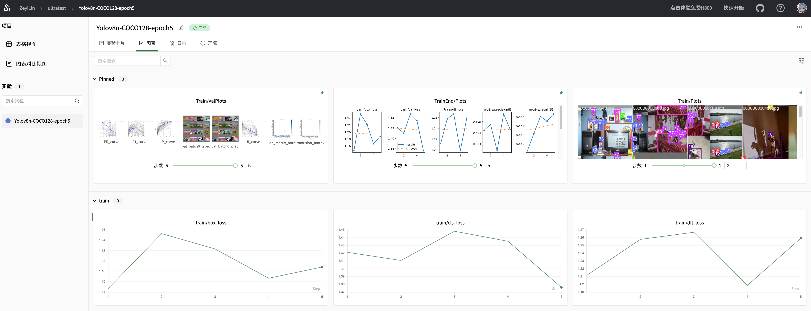

# SwanLab VSCode Plugin

官网：https://swanlab.cn

## 功能

SwanLab 是一款开源、轻量的 AI 实验跟踪工具，提供了一个跟踪、比较、和协作实验的平台。

SwanLab 提供了友好的 API 和漂亮的界面，结合了超参数跟踪、指标记录、在线协作、实验链接分享等功能，让您可以快速跟踪 AI 实验、可视化过程、记录超参数，并分享给伙伴。

本插件是由SwanLab团队官方维护的VSCode插件，能够实现：

1. 在VSCode中打开SwanLab云端版网页
2. 基于`swanlog`日志文件夹，在VSCode中打开SwanLab本地版网页

## 更新日志

- `v1.0.3`: 增加了对 swanlab 代码的检测，增加了 CodeLens 功能
- `v1.0.2`: 增加了顶部控制条，增加页面缩放和刷新功能
- `v1.0.1`: 初始版本

## 使用方法

在VSCode中使用`Ctrl+Shift+P`（MacOS: `Cmd+Shift+P`）打开命令面板：

- `Python: Launch SwanLab`
  - `Open Cloud SwanLab`: 打开云端版网页
  - `Open Local SwanLab`: 选择一个`swanlog`日志文件夹，打开本地版网页

 

**尽情享用！**