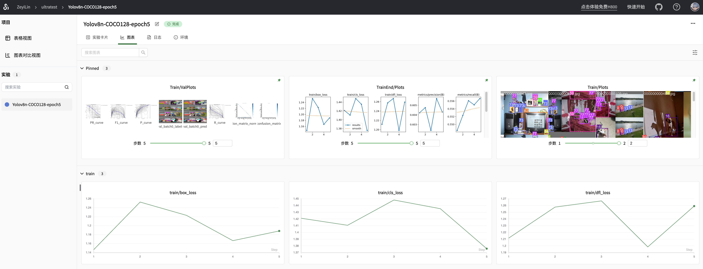

# SwanLab VSCode Plugin

Official Website: https://swanlab.cn

English | [中文](README.md)

## Features

SwanLab is an open-source, lightweight AI experiment tracking tool that provides a platform for tracking, comparing, and collaborating on experiments.

SwanLab offers a user-friendly API and a beautiful interface, combining features such as hyperparameter tracking, metrics logging, online collaboration, and experiment link sharing, allowing you to quickly track AI experiments, visualize processes, record hyperparameters, and share them with your peers.

This plugin is an officially maintained VSCode extension by the SwanLab team, which enables:

1. Opening the SwanLab cloud version webpage in VSCode
2. Opening the SwanLab local version webpage in VSCode based on the `swanlog` log folder

## Changelog

- `v1.0.3`: Added detection for swanlab code and introduced CodeLens feature
- `v1.0.2`: Added a top control bar, zooming, and refresh functionality
- `v1.0.1`: Initial version

## Usage

Use `Ctrl+Shift+P` (MacOS: `Cmd+Shift+P`) in VSCode to open the command palette:

- `Python: Launch SwanLab`
  - `Open Cloud SwanLab`: Open the cloud version webpage
  - `Open Local SwanLab`: Select a `swanlog` log folder to open the local version webpage

 

**Enjoy!**